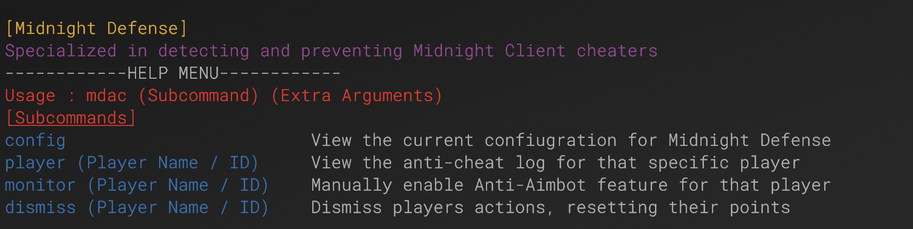
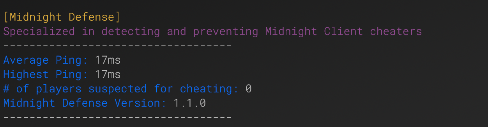
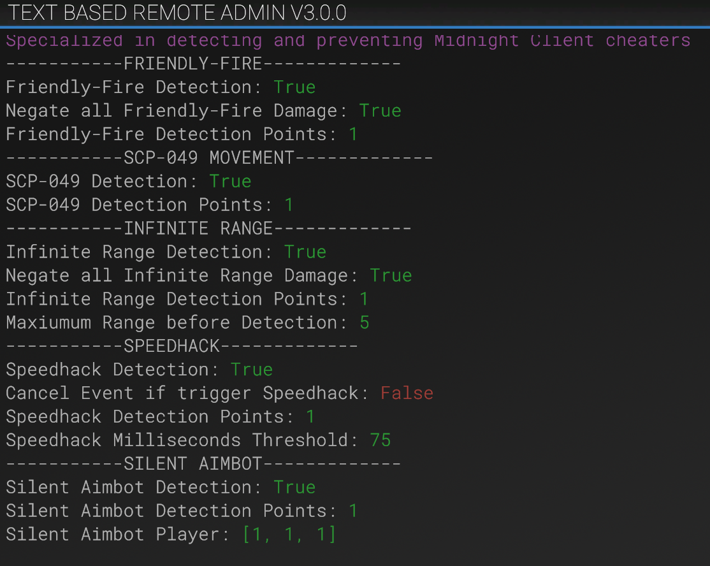
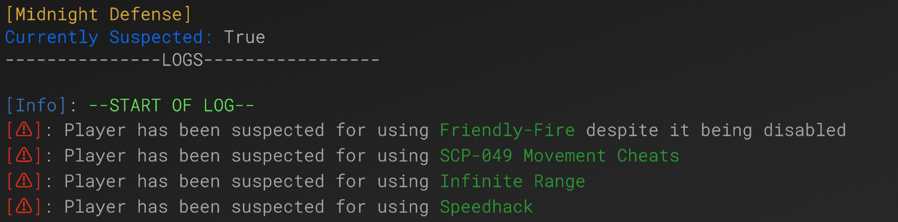

# Midnight Defense
### Specialized in detecting and preventing Midnight Client Cheaters

## Description
Midnight is a hacked client for SCP:SL, and so far there hasn't been much to prevent cheaters once they bypass SL-AC. Midnight Defense aims to accomplish that goal to prevent cheaters from ruining other players experiences. **Midnight Defense does not interfer with SCP:SL's base anti-cheat, rather it tackles whole different set of challenges**

## Current Alerts
- It's recommended to lower SpeedhackDetectionThreshold. Experiment with your server and find what works best

## Detections
Midnight Defense has protection against the following cheats with more planned in the future:

- Friendly-Fire **[ Completed ]**
  - Cheaters are able to teamkill other players despite friendly-fire being disabled on the server
  - Also prevents SCP teamkilling
- SCP-049 Movement **[ Completed ]**
  - Cheaters are able to revive their zombies while moving and attacking other players
- Infinite Range **[ Completed ]**
  - Cheaters playing as an SCP are able to kill others while being outside the normal range to attack others
- Speedhack **[ Completed ]**
  - Cheaters are able to speed their game up to have such advantages such as increases movement speed, and faster firing rates
- Silent Aimbot **[ Completed ]** **[Must be manually enabled on a player]**
  - Cheaters are able to have all the functionality of aimbot despite it looking on other players screens that they are missing all their shots
  - Due to not much being known about this, to cut down on potential errors you have to use a command in order to have this feature on the player
  
## Configuration:

### For more info about each configuration, view the link below:
>- <a href="ConfigBreakdown.md#Configuration Breakdown">Configuration Breakdown</a>

```yml
# Whether the plugin is enabled or not
is_enabled: true
# Should Friendly-Fire Detection be enabled
f_f_detection: true
# Disable Friendly-Fire Damage
negate_f_f_damage: true
# Points given when friendly-fire event is triggered
f_f_detection_points: 1
# Should SCP-049 Movement Detection be enabled
s_c_p049_detection: true
# Points given when SCP-049 Movement event is triggered
s_c_p049_detected_movement_points: 1
# Infinite Range Detection
infinite_range_detection: true
# Distance that SCP's are allowed to attack players
range_distance: 5
# Should negate all damage if a player is being attacked from a range that is set outside of the range distance
negate_infinite_range_damage: true
# Points given when infinite range event is triggered
infinite_range_detection_points: 1
# Should Silent Aimbot Detection be enabled? (Places Dummy Player near the suspected players crosshair and teleports around every so often to detect if they are aimbotting)
silent_aimbot_detection: true
# Points given when suspected player triggers the anti-aimbot
silent_aimbot_detection_points: 1
# Size of Anti-Aimbot Player
silent_aimbot_player_size:
- 1
- 1
- 1
# If anyone shoots the anti-aimbot player, it will automatically kick them (Default : False)
disconnect_on_anti_aimbot_hit: false
# How many hits to the anti-aimbot player it takes until the cheat is detected
silent_aimbot_hit_threshold: 8
# How often should the Anti-Aimbot NPC teleport?
silent_aimbot_teleport_time: 0.15
# How many cheater reports does it take for the Anti-Aimbot to trigger on the suspected player
silent_aimbot_trigger_report_amount: 3
# Speedhack Detection
speedhack_detection: true
# Points given when suspected player triggers Speedhack
speedhack_detection_points: 1
# Speedhack Millisecond Threshold (DO NOT GO OVER 80)
speedhack_detection_threshold: 75
# If Speedhack is detected, should the current action be cancelled?
speedhack_detection_cancel_event: false
# Alert Threshold (Points until any online staff are notified)
point_threshold: 10
# When a player reaches a certain amount of points, should staff be alerted?
alert_online_staff: true
# Maximum times an alert will notify staff / discord about the cheater
alert_max_times: 3
# How often does the plugin check if anyone has reached the point threshold to alert staff
alert_timeframe: 10
# Enable Discord Webhook Alerts
discord_webhook_enabled: false
# Discord Webhook Username
discord_webhook_username: Midnight Defense Alerts
# Discord Webhook URL
discord_webhook_u_r_l: discordURLhere
```

## Translation
```yml
# Friendly-Fire Detection Message
f_f_detected_message: Player has been suspected for using <color=#2ea339>Friendly-Fire</color> despite it being disabled
# SCP-049 Movement Detection Message
s_c_p049_detected_message: Player has been suspected for using <color=#2ea339>SCP-049 Movement Cheats</color>
# Infinite Range Detection Message
infinite_range_detection_message: Player has been suspected for using <color=#2ea339>Infinite Range</color>
# Speedhack Detection Message
speedhack_detection_message: Player has been suspected for using <color=#2ea339>Speedhack</color>
# Silent Aimbot Detection Message
silent_aimbot_detection_message: Player has been suspected for using <color=#2ea339>Silent Aimbot</color>
# Alert Message
point_threshold_message: <color=#f0311f>%player% has been detected for cheating!</color>
# Discord Alert Message
discord_alert_message: '%player% has been detected for cheating! Detected Cheats [%cheats%]'
# Anti-Aimbot NPC Name
silent_aimbot_n_p_c_name: MD-AC
```

## Commands
### Parent Command: mdac
MDAC Subcommands:
- config
- player (Player Name / ID) : Displays the player log w/ all of Midnight Defenses info about the player
- monitor (Player Name / ID) : Manually place the Anti-Aimbot NPC to start monitoring the player
- dismiss (PLayer Name / ID) : Dismiss all of their previous detections / alerts

## Permissions
```
md.general - Access all of the Midnight Defense Commands
md.ffbypass - Bypass the Friendly-Fire Detection
md.049bypass - Bypass SCP-049 Movement Detection
md.rangebypass - Bypass Infinite Range Detection
md.speedhackbypass - Bypass Speedhack Detection
md.aimbotbypass - Bypass Aimbot Detection
md.noclipbypass - Bypass NoClip Detection
```

## How Anti-aimbot works
If you read above, you'll see reference to a **Anti-Aimbot NPC**, all the NPC does is teleport around the suspected players crosshair to test whether or not the user is using Aimbot. It should be noted, this feature has not been fully experimented due to the fact that the only way to test this, is to boot up the Midnight Client

## Preview:
### Help Menu:

### Info about Midnight Defense:

### Configuration

### Player Log


## Credits:
- This plugin uses a modified class from https://github.com/BuildBoy12/Npcs
